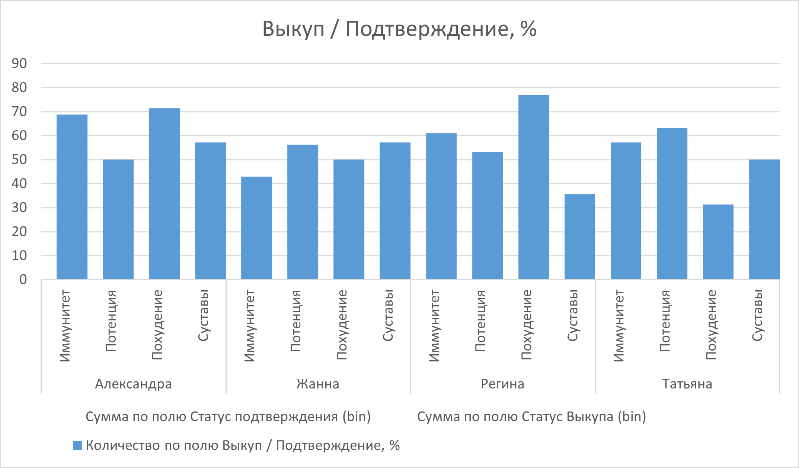

# Оценка эффективности операторов call-центра
## Задача
1.	Дайте оценку, какой оператор по какой категории товаров работает наиболее эффективно,
2.	Объясните свои выводы.

## Решение
Добавил столбец отношения выкупов к подтверждениям в процентах. Для упрощения расчетов в исходных данных добавил столбцы "Статус подтверждения (bin)" и "Статус выкупа (bin)", в которых "Подтвержден" и "Выкуплен" заменил на 1, а остальные значения - на 0.

Для оценки эффективности работы операторов я составил сводную таблицу, в которой строки соответствуют имени оператора (группа) и категории товаров (элемент группы). В столбцах вывел суммы по статусу подтверждения и статусу выкупа.

## Выводы
Наилучшее соотношение подтверждения к выкупу у Александры и Регины относится к категории "Похудение". Жанна наиболее эффективна в категории "Суставы". Татьяна - в "Потенции".
